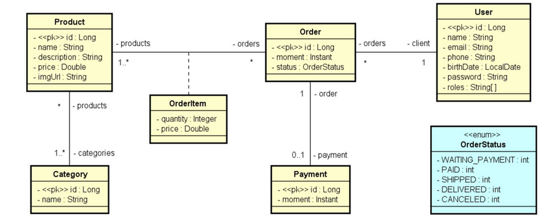
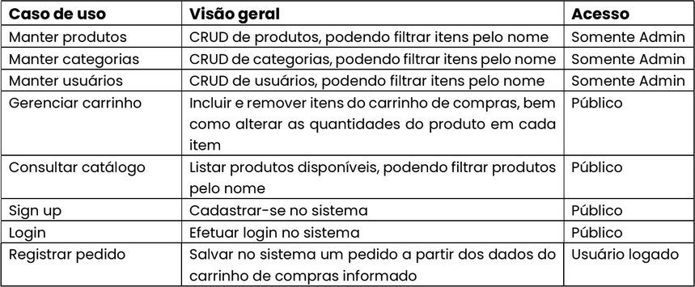

Este projeto consiste em uma API REST de um Comércio Eletrônico, onde é possível gerenciar Produtos, Pedidos e Clientes.

<a id="modelo-conceitual"></a>
## Modelo Conceitual


<a id="requisitos"></a>
## Requisitos
- [Java JDK (versão 17 ou superior)](https://www.oracle.com/java/technologies/javase/jdk17-archive-downloads.html)
- [Git](https://git-scm.com/downloads) - Sistema de controle de versão de código aberto
- [Uma conta no Github](https://github.com/) - Plataforma de controle de versões
- [Postman](https://www.postman.com/downloads/) ou [Insomnia](https://insomnia.rest/download) - Ferramentas para testar a API
- [Docker (Opcional)](https://www.docker.com/products/docker-desktop/) - Para rodar a aplicação localmente
- [PostgreSQL (Opcional)](https://www.postgresql.org/download/) - Para rodar a aplicação localmente, caso não queira instalar o Docker

<a id="documentação-da-api"></a>
## Documentação da API

<a id="acessando-localmente"></a>
### Acessando localmente

1. [Rode a aplicação localmente](#rodando-localmente)
2. Gere um token de acesso
- Abra um ferramenta para testar a API (Postman, Insomnia...)
- Acesse a url abaixo:
```bash
http://localhost:8080/oauth2/token
```
- Na aba Authorization, acrescente as seguintes informações:
    - Em Auth Type selecione Basic Auth
    - Preencha os campos Username e Password com os seguintes valores:

        | Campo   | Valor       | Descrição                           |
        | :---------- | :--------- | :---------------------------------- |
        | Username | {{client-id}} | Valor do client-id definido no application.properties |
        | Password | {{client-secret}} | Valor do client-secret definido no application.properties |

- Envie a requisição e obtenha o token
- Acesse o endereço:
```bash
  http://localhost:8080/swagger-ui.html
```
- Adicone o token em Authorize
- Acesse as rotas
<a id="funcionalidades"></a>
## Funcionalidades

- Cadastrar usuário no sistema
- Logar usuário no sistema
- Gerenciar Pedidos
- Gerenciar Produtos
- Gerenciar usuários
- Gerenciar categorias

<a id="tecnologias-utilizadas"></a>
## Tecnologias Utilizadas

- Java
- Spring boot
- JPA / Hibernate
- PostgreSQL
- H2

<a id="aprendizados"></a>
## Aprendizados

Neste projeto foi possível aprender sobre Bean Validation, usado para fazer validações dos dados de entrada da API, sobre o Spring Security, usado para permitir a autenticação dos usuários, além de gerenciar a autorização para o uso das rotas da API pelo usuário. E, por fim, foi possível aprender mais sobre a criação e utilização de exceções customizadas.

<a id="rodando-localmente"></a>
## Rodando localmente

Clone o projeto

```bash
  git clone https://github.com/hakkinenT/java-spring-boot-dscommerce.git
```

Entre no diretório do projeto

```bash
  cd java-spring-boot-dscommerce
```

Rode a aplicação

```bash
  ./mvnw spring-boot:run
```

<a id="rodando-os-testes"></a>
## Rodando os testes

Para rodar os testes, rode o seguinte comando

```bash
  mvn test
```

